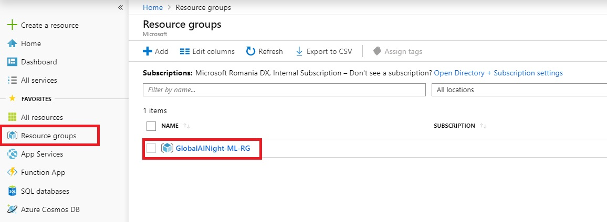
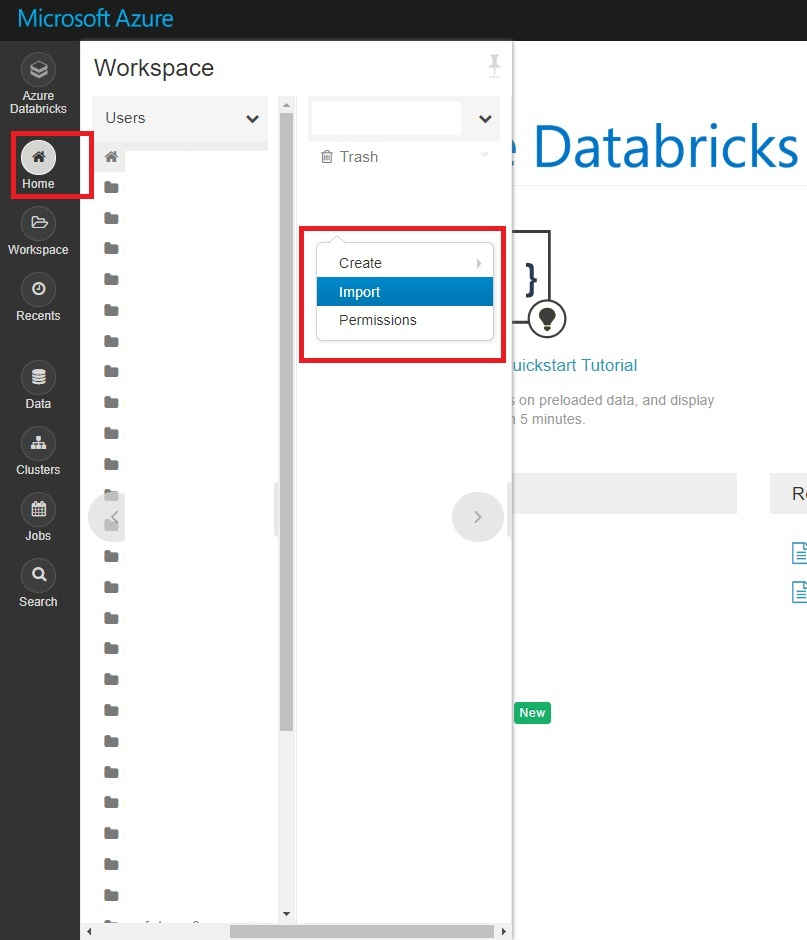

# Global AI Night Bucharest - Lab Setup Instructions

In order to set up your lab environment, please follow these steps.

## Prerequisites

1. A Microsoft Azure subscription. Refer to your lab instructor or [click here](https://azure.microsoft.com/en-us/free/) to get a free Azure Trial.

## Setup

Once you have access to an Azure subscription, follow these steps to set up the lab:

1. Navigate to the [Azure Portal](https://portal.azure.com/) and log in with the correct credentials.
2. Navigate to the Resource Group named **GlobalAINight-ML-RG**. If this does not exist, [create it](https://docs.microsoft.com/en-us/azure/azure-resource-manager/resource-group-template-deploy-portal#create-a-resource-group). 

    

3. In the Resource Group, verify that the following two services exist. If they don't (for example, if you've just created a new subscription), you can create them now. In this case, you can choose any service names and Azure regions you like.

    |  Name   |      Type      |   |
    |----------|:-------------:|------:|
    | **globalainight-ml-wksp** |  Machine Learning Service Workspace | [How to create](https://docs.microsoft.com/en-us/azure/machine-learning/service/how-to-manage-workspace#create-a-workspace) |
    | **globalainight-databricks** |   Azure Databricks Service   | [How to create](https://docs.microsoft.com/en-us/azure/azure-databricks/quickstart-create-databricks-workspace-portal#create-an-azure-databricks-workspace) |

    

4. Navigate to the **globalainight-databricks**    Azure Databricks Service, and click the **Launch Workspace** button.

    

5. After logging in to the Azure Databricks workspace, navigate to your home folder by clicking **Home**. In your home folder, **right click** and select **Import**.

    

6. In the Import wizard, select **URL** and import the following two files from this Github repository:

    - https://raw.githubusercontent.com/dlawrences/GlobalAINightBucharest/master/notebooks/Global%20AI%20Night%20-%20Credit%20Scoring.py
    - https://raw.githubusercontent.com/dlawrences/GlobalAINightBucharest/master/notebooks/Global%20AI%20Night%20-%20Service%20Deployment.py

    > NOTE: You will need to perform the Import step once for each file.

7. Open the first notebook, **Global AI Night - Credit Scoring**. In the upper left area of the notebook window, click the *Detached* area to select a cluster to attach to and run your notebook. 

    

Congratulations! You're now done with the setup and can start using the notebooks.